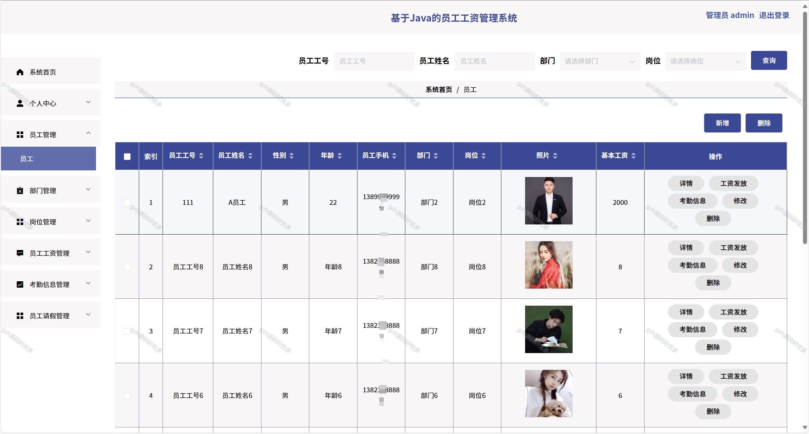

# springbootA297
springbootA297员工工资管理系统
 
## 查看主页获取源码

### 一、关键词
员工薪资管理系统，员工薪资核算系统，职员工资管理系统

### 二、作品包含
源码+数据库+全套环境和工具资源+本地部署教程

### 三、项目技术
前端技术：Html、Css、Js、Vue2.0、Element-ui 
后端技术：Java、SpringBoot2.0、MyBatis

### 四、运行环境（以下版本亲测，其他版本兼容性请自行测试）
开发工具：IDEA/eclipse  + VSCODE

数据库：MySQL5.7（最低要5.7版本）

数据库管理工具：Navicat10以上版本

环境配置软件： JDK1.8 + Maven3.6.3

前端Nodejs：14

浏览器：谷歌浏览器

### 五、项目介绍
项目编号：springbootA297

员工工资管理系统能高效、准确地完成员工工资的核算、发放、个税计算、社保公积金扣缴及相关数据统计分析等工作，简化薪资管理流程。
员工工资管理系统，具备员工、部门、岗位信息管理，工资核算（含薪资构成及发放）、考勤统计（记录出勤状态）、请假审批等功能，助力企业高效管理员工薪资及人事流程 。

### 六、运行截图

